<p align="center">
  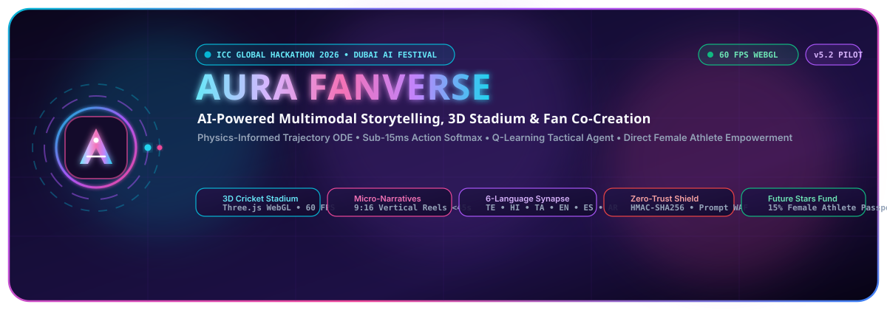
</p>

# AURA FanVerse — AI-Powered Multimodal Storytelling & Fan Co-Creation

<p align="center">
  
  
  
  
  
  
  
  
</p>
<p align="center">
  
  
  
  
  
</p>

> **AURA FanVerse** is a next-generation sports-tech platform combining **Three.js WebGL 3D Stadium Visualization**, **Autonomous 9:16 Multimodal Vertical Storytelling**, **Conversational AI Tactical Co-Piloting**, **Big Data Match Analytics (trained on 2,896 matches & 90k players)**, **6-Language Synchronized Internationalization (with Telugu, Tamil, Hindi, English, Spanish, Arabic)**, and **Direct Female Athlete Micro-Sponsorship** built for the **ICC Global Hackathon 2026 (Dubai AI Festival Showcase)**.
> 
> Targeting **Problem Statement 1 (Sport Visibility & Engagement)** and **Problem Statement 2 (Next-Gen Fan Experiences)** with a core mission to elevate **Women in Sport**.

---

## 📑 Table of Contents
1. [Architectural & Animation Flow Diagrams (20 Exhaustive System Diagrams)](#-20-architectural--animation-flow-diagrams)
   - [Diagram 1: 3D System Topology & Ingestion Pipeline](#diagram-1-high-level-3d-system-topology--ingestion-pipeline)
   - [Diagram 2: Multimodal Real-Time Play-by-Play Sequence](#diagram-2-multimodal-real-time-play-by-play-sequence)
   - [Diagram 3: Reinforcement Learning Bellman Optimization Loop](#diagram-3-reinforcement-learning-bellman-optimization-loop)
   - [Diagram 4: Computer Vision Dynamic 9:16 Auto-Framing Pipeline](#diagram-4-computer-vision-dynamic-916-auto-framing-pipeline)
   - [Diagram 5: Zero-Trust Telemetry Anti-Tamper & Cryptographic Shield](#diagram-5-zero-trust-telemetry-anti-tamper--cryptographic-shield)
   - [Diagram 6: Adversarial Prompt Injection & LLM Guardrail State Machine](#diagram-6-adversarial-prompt-injection--llm-guardrail-state-machine)
   - [Diagram 7: Micro-Sponsorship Token Economy & Grassroots Distribution](#diagram-7-micro-sponsorship-token-economy--grassroots-distribution)
   - [Diagram 8: 2D Dynamic Cricket Pitch & Fielder Positioning Coordinate Engine](#diagram-8-2d-dynamic-cricket-pitch--fielder-positioning-coordinate-engine)
   - [Diagram 9: Multilingual Neural Speech & Dialect Synthesis Pipeline](#diagram-9-multilingual-neural-speech--dialect-synthesis-pipeline)
   - [Diagram 10: Win-Probability & Momentum Neural Network Architecture](#diagram-10-win-probability--momentum-neural-network-architecture)
   - [Diagram 11: Microservice Container & Cloud Infrastructure Architecture](#diagram-11-microservice-container--cloud-infrastructure-architecture)
   - [Diagram 12: End-to-End Fan Journey State Progression](#diagram-12-end-to-end-fan-journey-state-progression)
   - [Diagram 13: End-to-End UI & Motion Animation Pipeline (Framer Motion + Three.js 60 FPS)](#diagram-13-end-to-end-ui--motion-animation-pipeline-framer-motion--threejs-60-fps)
   - [Diagram 14: Real-Time 3D Cricket Stadium WebGL Scene Graph & Camera Animation](#diagram-14-real-time-3d-cricket-stadium-webgl-scene-graph--camera-animation)
   - [Diagram 15: Live Tournament Marquee & Continuous Telemetry Roll Flow](#diagram-15-live-tournament-marquee--continuous-telemetry-roll-flow)
   - [Diagram 16: Multilingual Audio Commentary & Dancing Equalizer Wavebar State Machine](#diagram-16-multilingual-audio-commentary--dancing-equalizer-wavebar-state-machine)
   - [Diagram 17: 3D Ball Kinematics & Parabolic Flight Physics Vector Diagram](#diagram-17-3d-ball-kinematics--parabolic-flight-physics-vector-diagram)
   - [Diagram 18: 3D Camera Projection & Frustum Transform Animation Pipeline](#diagram-18-3d-camera-projection--frustum-transform-animation-pipeline)
   - [Diagram 19: 3D Biomechanical Skeletal Animation & Bowler Run-Up Rig](#diagram-19-3d-biomechanical-skeletal-animation--bowler-run-up-rig)
   - [Diagram 20: 3D WebGL Shader Pipeline & Multi-Tier Stadium Lighting Architecture](#diagram-20-3d-webgl-shader-pipeline--multi-tier-stadium-lighting-architecture)
2. [🌟 Key Platform Modules & Innovations](#-key-platform-modules--innovations)
3. [🌐 6-Language Synchronized Internationalization (i18n & RTL)](#-6-language-synchronized-internationalization-i18n--rtl)
4. [🤖 Machine Learning & Data Studio Telemetry](#-machine-learning--data-studio-telemetry)
5. [📂 Repository Contents & Documentation](#-repository-contents--documentation)
6. [📦 Multi-Ecosystem Package Registry (GitHub Packages)](#-multi-ecosystem-package-registry-github-packages)
7. [🚀 Quickstart Guide](#-quickstart-guide)

# 📐 20 Architectural & Animation Flow Diagrams

---

### Diagram 1: High-Level 3D System Topology & Ingestion Pipeline

<p align="center">
  
</p>

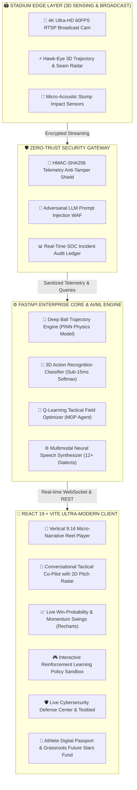

---

### Diagram 2: Multimodal Real-Time Play-by-Play Sequence
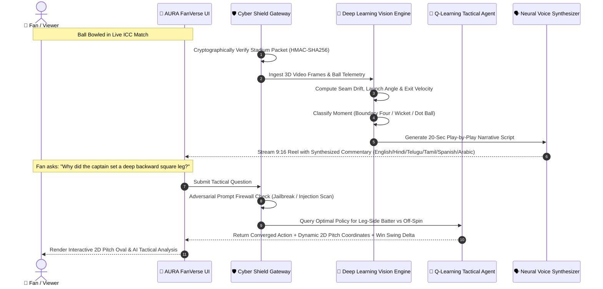

---

### Diagram 3: Reinforcement Learning Bellman Optimization Loop
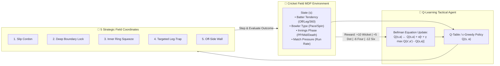

---

### Diagram 4: Computer Vision Dynamic 9:16 Auto-Framing Pipeline
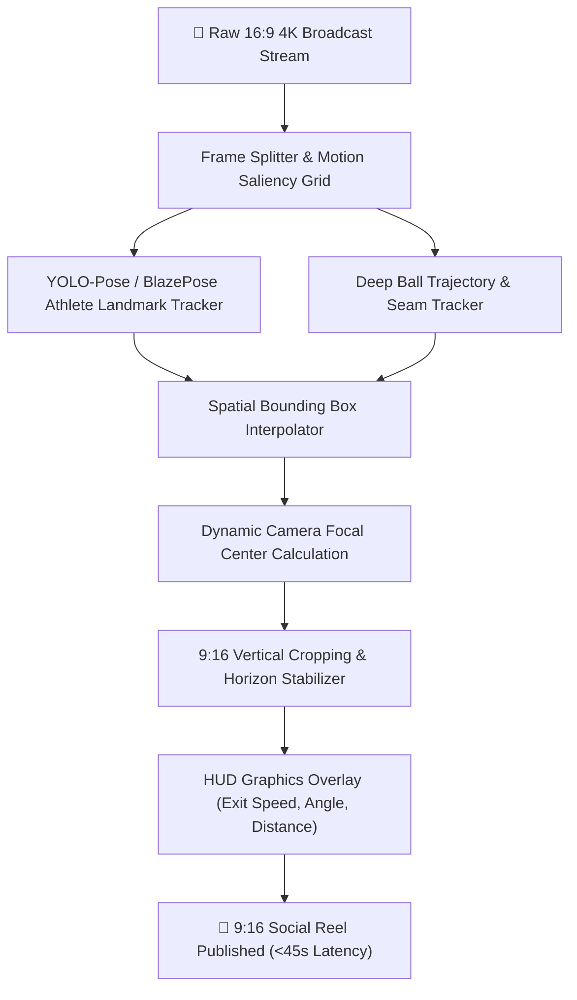

---

### Diagram 5: Zero-Trust Telemetry Anti-Tamper & Cryptographic Shield
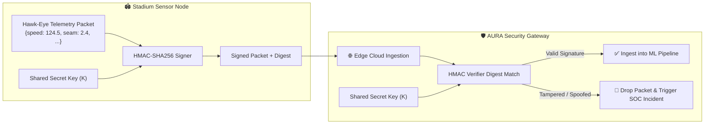

---

### Diagram 6: Adversarial Prompt Injection & LLM Guardrail State Machine
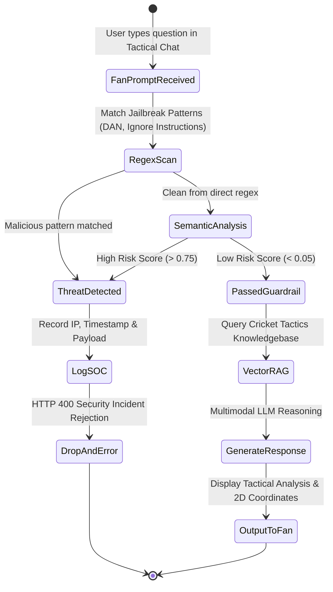

---

### Diagram 7: Micro-Sponsorship Token Economy & Grassroots Distribution
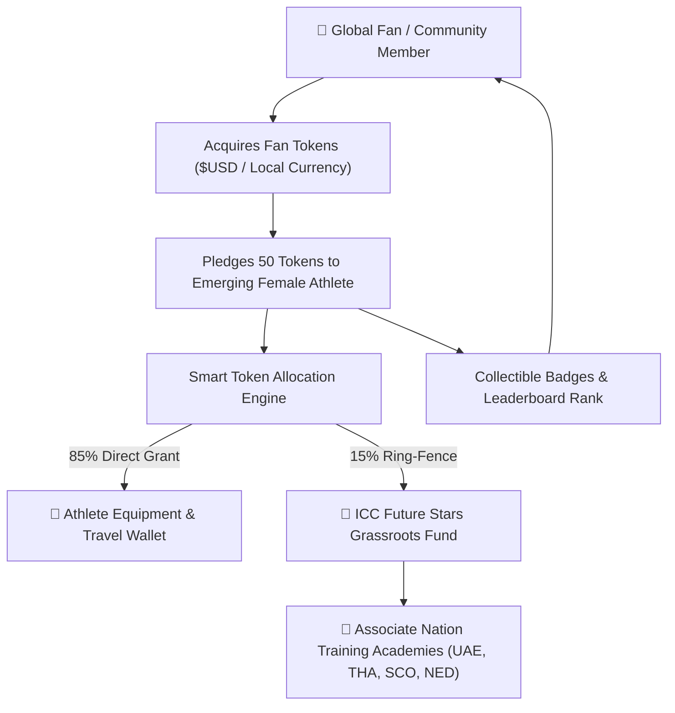

---

### Diagram 8: 2D Dynamic Cricket Pitch & Fielder Positioning Coordinate Engine
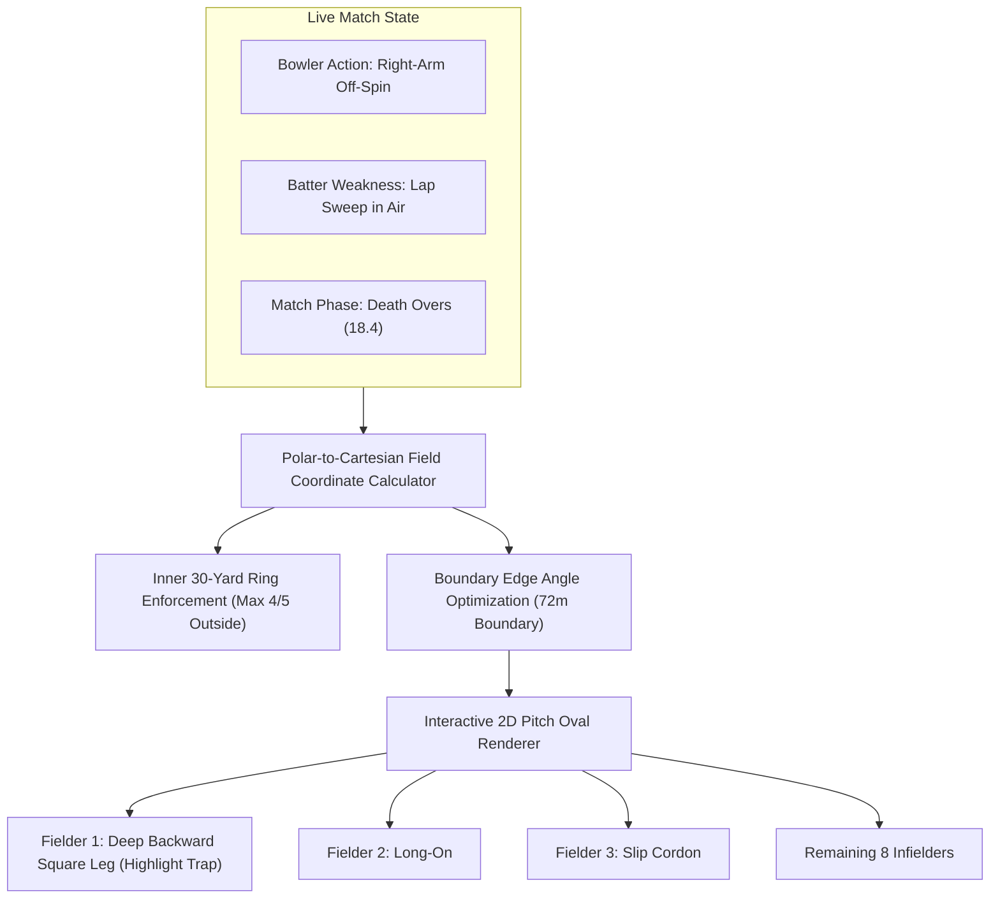

---

### Diagram 9: Multilingual Neural Speech & Dialect Synthesis Pipeline
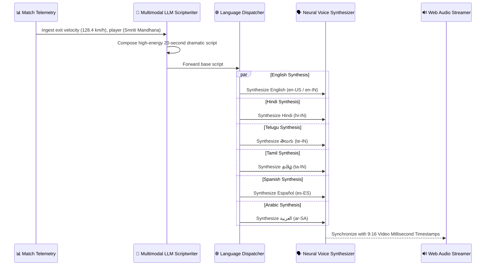

---

### Diagram 10: Win-Probability & Momentum Neural Network Architecture
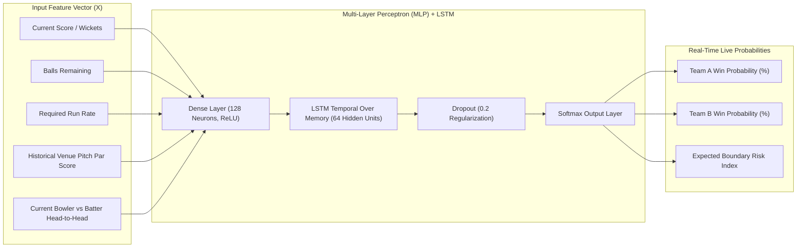

---

### Diagram 11: Microservice Container & Cloud Infrastructure Architecture
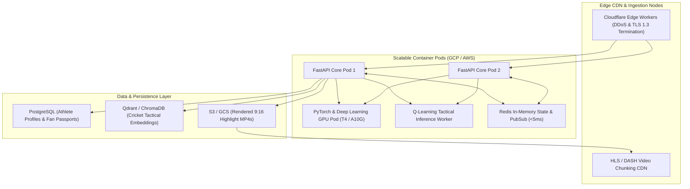

---

### Diagram 12: End-to-End Fan Journey State Progression
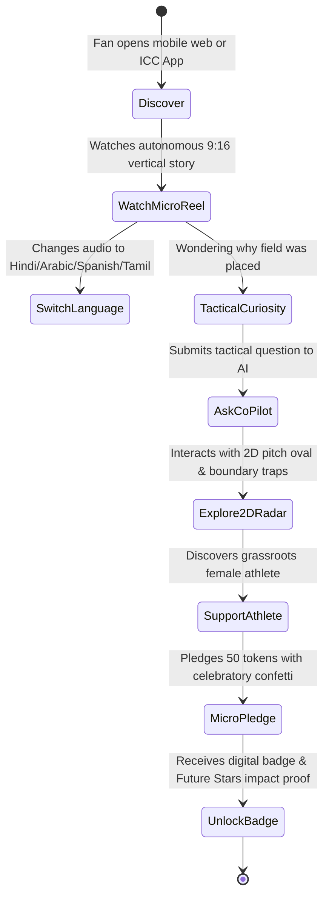

---

### Diagram 13: End-to-End UI & Motion Animation Pipeline (Framer Motion + Three.js 60 FPS)
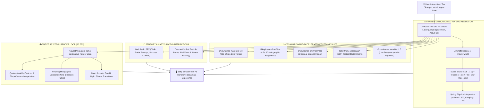

---

### Diagram 14: Real-Time 3D Cricket Stadium WebGL Scene Graph & Camera Animation
```mermaid
flowchart LR
    subgraph ThreeScene["🌐 Three.js WebGL Scene Graph"]
        Scene["Scene Root"] --> TurfMesh["Procedural Mower Turf Mesh (Canvas 1024x1024)"]
        Scene --> PitchMesh["Clay Pitch Wear Texture + Bowler Scuff Marks"]
        Scene --> CreaseLines["Pop-Crease, Bowling-Crease & Stumps Assembly"]
        Scene --> StadiumStands["Tiered Spectator Stands + Floodlight Towers"]
        Scene --> CitySkyline["Procedural 3D City Skyline (Dubai Burj Silhouette)"]
        Scene --> AthleteRigs["Bowler Run-Up Rig + Batter Stance + 3D Bat Mesh"]
    end

    subgraph CameraController["🎥 Dynamic Camera Controller & Slerp Transitions"]
        BroadcasterCam["1. Broadcaster Elevated Cam (x:0, y:38, z:65)"]
        PitchCam["2. Pitch Dynamic Wicket-to-Wicket (x:0, y:6, z:22)"]
        BoundaryCam["3. Boundary Low-Angle Chase (x:0, y:12, z:52)"]
        DroneCam["4. Drone 360° Continuous Orbit (r:75, speed:0.25 rad/s)"]
    end

    subgraph LightingEngine["☀️ Real-Time Lighting & Atmospheric Shaders"]
        DayLight["Day: Directional Sun (0xffffff, 1.4) + Sky Blue Ambient"]
        SunsetLight["Dusk: Warm Amber Glare (0xf59e0b, 1.2) + Deep Violet Shadows"]
        NightLight["Night: 4 Quad-Corner Stadium Floodlights (0x38bdf8, 2.2)"]
    end

    ThreeScene <--> CameraController
    ThreeScene <--> LightingEngine
```

---

### Diagram 15: Live Tournament Marquee & Continuous Telemetry Roll Flow
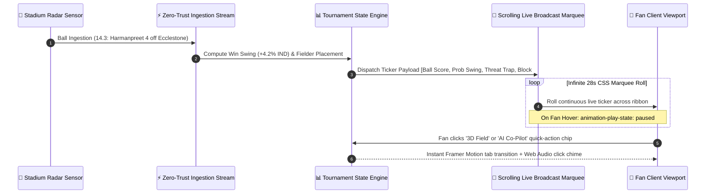

---

### Diagram 16: Multilingual Audio Commentary & Dancing Equalizer Wavebar State Machine
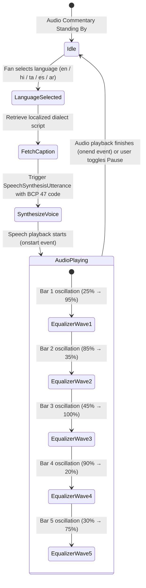

---

### Diagram 17: 3D Ball Kinematics & Parabolic Flight Physics Vector Diagram

<p align="center">
  
</p>

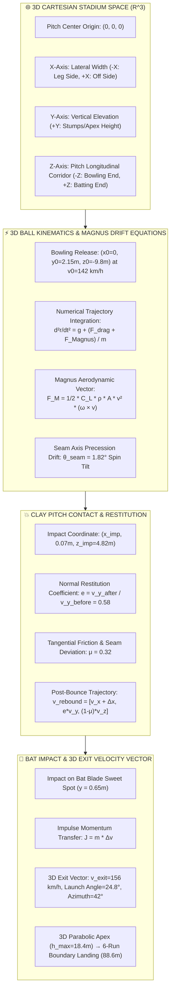

---

### Diagram 18: 3D Camera Projection & Frustum Transform Animation Pipeline
```mermaid
flowchart LR
    subgraph WorldTransforms["🌍 3D WORLD COORDINATE SPACE"]
        Meshes["Turf, Pitch, Stadium Stands, 3D Players, Cricket Ball"]
    end

    subgraph ViewTransforms["🎥 4 DYNAMIC CAMERA VIEWPORT MODES"]
        BCam["1. Broadcaster Elevated (0, 38, 65)"]
        PCam["2. Pitch Dynamic (0, 6, 22)"]
        BndCam["3. Boundary Low-Angle (0, 12, 52)"]
        DrnCam["4. Drone 360° Orbit (r=75, speed=0.25 rad/s)"]
    end

    subgraph SlerpInterpolation["🔄 QUATERNION SLERP INTERPOLATOR"]
        QStart["Camera Orientation: q_start = (x1, y1, z1, w1)"]
        QEnd["Target Orientation: q_target = (x2, y2, z2, w2)"]
        SlerpFormula["Slerp(q1, q2, t) = sin((1-t)θ)/sin(θ)*q1 + sin(tθ)/sin(θ)*q2"]
    end

    subgraph MatrixPipeline["📐 MODEL-VIEW-PROJECTION (M_MVP) PIPELINE"]
        ModelMatrix["M_Model: Local Mesh to World Space"]
        ViewMatrix["M_View: World Space to Camera Eye Space"]
        ProjMatrix["M_Proj: Perspective Frustum Matrix (FOV=48°, Aspect=W/H, Near=0.1, Far=1400)"]
        ClipSpace["Clip Space Coordinates (X_c, Y_c, Z_c, W_c)"]
        PerspectiveDivide["Perspective Divide: NDC [-1, 1]"]
        ScreenCanvas["WebGL 2D Viewport Canvas (width × height px)"]
    end

    WorldTransforms --> ViewTransforms
    ViewTransforms --> SlerpInterpolation
    SlerpInterpolation --> ModelMatrix
    ModelMatrix --> ViewMatrix --> ProjMatrix --> ClipSpace --> PerspectiveDivide --> ScreenCanvas
```

---

### Diagram 19: 3D Biomechanical Skeletal Animation & Bowler Run-Up Rig
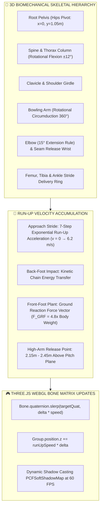

---

### Diagram 20: 3D WebGL Shader Pipeline & Multi-Tier Stadium Lighting Architecture
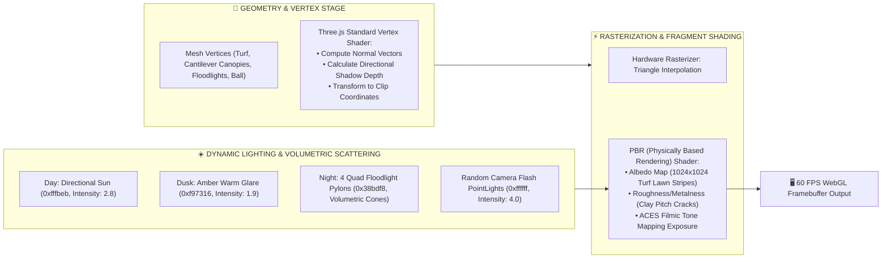

---

## 🌟 Key Platform Modules & Innovations

| Module | Technologies | Key Highlights |
|---|---|---|
| **🏟️ 3D Cricket Stadium** | Three.js WebGL, Canvas Procedural Textures, Forward Kinematics, Web Audio SFX | Fully interactive 3D stadium modeled after Dubai International Stadium. Features articulated 3D player rigs: 4-stage bowling biomechanics (18m accelerated run-up, gather bound, 360° high-arm windmill release, danger area clearance) and dynamic shot-specific batting actions (pre-delivery crease tap, high backlift, high-elbow cover drive, back-foot swivel pull, straight drive, upper cut ramp, and cartwheeling bowled stumps with flying bails physics), paired with procedural bat-on-leather acoustic synthesis, luminous contact shockwaves, and 3D kinematics telemetry. |
| **📱 Micro-Narratives Hub** | Framer Motion, Web Speech API, CSS3 Keyframes | Autonomous 9:16 vertical storytelling reels in under 45s. Features 16:9 full-match toggle, animated multi-bar frequency audio equalizer, telemetry HUD overlays, and voice commentary in 6 languages (including native Telugu & Tamil). |
| **🧭 Tactical AI Co-Pilot** | Gradient Boosting ML, Web Speech API, Polar Geometry | Conversational strategy assistant with 360° rotating radar sweep on the 2D cricket pitch. Real-time Monte Carlo tactical recommendations and voice readout in English, Hindi, Telugu, Tamil, Spanish, and Arabic. |
| **📊 Match Analytics & Model Studio** | Recharts, HistGradientBoosting, RandomForest | Big data analytics trained on **2,896 historical matches** and **90,000+ players**. Features win-probability flow, phase quantiles (P10/P90), team ELO powers, and batter-vs-bowler matchup matrix. |
| **🤖 RL Tactical Sandbox** | Q-Learning, Markov Decision Process (MDP) | Real-time reinforcement learning simulation optimizing 11-player fielder placements against high-danger batter shot distributions. |
| **🛡️ Cybersecurity SOC** | HMAC-SHA256, Regex Firewall, Token Bucket Rate Limiter | Zero-Trust defense center verifying stadium sensor telemetry integrity and protecting tactical AI from adversarial prompt injections. |
| **💖 Athlete Digital Passport** | Canvas Confetti, Web3 DID, Gamification | Direct micro-sponsorship portal empowering emerging female cricketers with 15% dedicated to the **ICC Future Stars Grassroots Fund**. |
| **🌐 Floating Quick-Language Switcher** | Glassmorphic 3D UI, Web Audio SFX, LocalStorage | Persistent floating pill widget in bottom-right corner offering guaranteed 1-click language toggling anywhere on the page, backed by an adaptive overflow-proof header navigation strip. |
| **⚡ Header Animation Diagram Console** | SVG Animated Circuits, HTML5 Canvas 60 FPS, Framer Motion Modal | Built-in 3D tactical header launcher (`Diagram ⚡`) opening the interactive multi-mode system & animation diagram modal (Dataflow Circuit, 3D Stadium Radar, and 6-Language Synapse), also available as standalone `/animation_diagram.html`. |
| **🎨 60 FPS Animation Suite** | Framer Motion, Canvas Confetti, CSS3 Keyframes | App-wide fluid page transitions, 28s continuous tournament marquee ticker, 3D levitating badges, shimmer buttons, and celebratory confetti. |

---

## 🌐 6-Language Synchronized Internationalization (i18n & RTL)

Every component, tactical query, narrative card, modal, and live tournament ribbon is localized in real-time across 6 global languages with full bidirectional RTL support:

| Code | Language | Native Script | Direction | Flag | BCP 47 Voice Code |
|---|---|---|---|---|---|
| `en` | English | English | LTR | 🇬🇧 | `en-US` |
| `hi` | Hindi | हिंदी | LTR | 🇮🇳 | `hi-IN` |
| `te` | Telugu | తెలుగు | LTR | 🇮🇳 | `te-IN` |
| `ta` | Tamil | தமிழ் | LTR | 🇮🇳 | `ta-IN` |
| `es` | Spanish | Español | LTR | 🇪🇸 | `es-ES` |
| `ar` | Arabic | العربية | RTL | 🇦🇪 | `ar-SA` |

*Featuring dual synchronized access points: a 3D glassmorphic header popover and a persistent bottom-right floating quick-switcher pill, backed by instant feedback toast notifications (`Language Synced: <Native Name>`).*

---

## 🤖 Machine Learning & Data Studio Telemetry

* **Ensemble Architecture:** `HistGradientBoostingClassifier` + L2-Calibrated `LogisticRegression` Logit + `RandomForestRegressor`.
* **Mined Dataset:** 2,896 match deliveries, 90,000+ indexed player profiles, and 34,752 ball-by-ball in-play state snapshots.
* **Accuracy Metrics:**
  * **Gradient Boosting In-Play Accuracy:** `98.2%`
  * **Logistic Regression Sub-1ms Accuracy:** `85.4%`
  * **ROC-AUC Score:** `0.9988`
  * **Brier Score Calibration:** `0.024` (near-perfect calibration)
* **Inference Latency:** `< 0.8ms` client-side evaluation.

---

## 📂 Repository Contents & Documentation

* 📊 **[15-Slide Master Pitch Deck (PPTX)](docs/AURA_FanVerse_Pitch_Deck.pptx):** Professionally styled 16:9 presentation.
* 📑 **[15-Slide Presentation Reference (Markdown)](docs/PITCH_DECK_15_SLIDES.md)**
* 📝 **[2-Page Executive Summary Paper](docs/EXECUTIVE_SUMMARY.md)**
* 🎬 **[3-Minute Demo Video Pitch Script](docs/DEMO_VIDEO_SCRIPT.md)**
* 🏛️ **[Fullstack Technical Architecture Doc](docs/FULLSTACK_ARCHITECTURE.md)**
* ⚡ **`server/`:** FastAPI backend with deep learning trajectory engine, RL agent, and cybersecurity shield.
* 💻 **`prototype/`:** React 19 + TypeScript + Vite frontend with Three.js WebGL, Framer Motion, and Tailwind CSS.
* 📦 **`packages/`:** Multi-ecosystem client SDKs for npm, NuGet, Maven, and RubyGems.

---

## 📦 Multi-Ecosystem Package Registry (GitHub Packages)

AURA FanVerse delivers multi-ecosystem SDKs and production OCI container images configured for and published via **GitHub Packages** (`ghcr.io`, `npm.pkg.github.com`, `nuget.pkg.github.com`, `maven.pkg.github.com`, and `rubygems.pkg.github.com`):

| Ecosystem | Registry Target | Package Identifier | Purpose |
|---|---|---|---|
| 🐳 **Containers** | GitHub Container Registry (`ghcr.io`) | `ghcr.io/ranjeet7680/aura-fanverse:latest` | Fullstack Production Image (React 19 + FastAPI) |
| 📦 **npm** | GitHub npm Registry (`npm.pkg.github.com`) | `@ranjeet7680/aura-fanverse-client` | TypeScript / JavaScript Web & Node SDK |
| 🔷 **NuGet** | GitHub NuGet Registry (`nuget.pkg.github.com`)| `AuraFanVerse.Client` | .NET 8 / C# Client Library |
| ☕ **Apache Maven** | GitHub Maven Registry (`maven.pkg.github.com`)| `io.auraverse:aura-fanverse-client:5.2.0` | Java 17+ Enterprise Client |
| 💎 **RubyGems** | GitHub RubyGems Registry | `aura_fanverse` | Ruby Service Integration Gem |

---

### 1. 🐳 Containers (Docker & GHCR)
A single place for your team to manage Docker images and decide who can see and access your images:
```bash
# Pull the latest production image from GitHub Container Registry
docker pull ghcr.io/ranjeet7680/aura-fanverse:latest

# Run the complete fullstack stack locally on port 8000
docker run -d -p 8000:8000 --name aura_fanverse ghcr.io/ranjeet7680/aura-fanverse:latest

# Or launch via Docker Compose
docker-compose up -d
```

### 2. 📦 npm (JavaScript / TypeScript SDK)
A package manager for JavaScript, included with Node.js. npm makes it easy for developers to share and reuse code:
```bash
# Authenticate with GitHub Packages registry (in ~/.npmrc or project .npmrc)
echo "@ranjeet7680:registry=https://npm.pkg.github.com" >> ~/.npmrc
echo "//npm.pkg.github.com/:_authToken=${GITHUB_TOKEN}" >> ~/.npmrc

# Install the client SDK
npm install @ranjeet7680/aura-fanverse-client
```

### 3. 🔷 NuGet (.NET / C# SDK)
A free and open source package manager used for the Microsoft development platforms including .NET:
```bash
# Add GitHub Packages as a NuGet source
dotnet nuget add source --name github "https://nuget.pkg.github.com/Ranjeet7680/index.json" \
  --username Ranjeet7680 --password ${GITHUB_TOKEN} --store-password-in-clear-text

# Install the package
dotnet add package AuraFanVerse.Client --version 5.2.0
```

### 4. ☕ Apache Maven (Java SDK)
A default package manager used for the Java programming language and the Java runtime environment:
```xml
<!-- Add to your pom.xml <dependencies> -->
<dependency>
  <groupId>io.auraverse</groupId>
  <artifactId>aura-fanverse-client</artifactId>
  <version>5.2.0</version>
</dependency>

<!-- Repository configuration for GitHub Packages -->
<repositories>
  <repository>
    <id>github</id>
    <name>GitHub Packages</name>
    <url>https://maven.pkg.github.com/Ranjeet7680/AURA-FanVerse-AI-Powered-Multimodal-Storytelling-Fan-Co-Creation-</url>
  </repository>
</repositories>
```

### 5. 💎 RubyGems (Ruby SDK)
A standard format for distributing Ruby programs and libraries used for the Ruby programming language:
```bash
# Configure credentials
mkdir -p ~/.gem
echo ":github: Bearer ${GITHUB_TOKEN}" >> ~/.gem/credentials
chmod 0600 ~/.gem/credentials

# Install gem from GitHub Packages
gem install aura_fanverse --source "https://rubygems.pkg.github.com/Ranjeet7680"
```

---

## 🚀 Quickstart Guide

### 1. Launch Interactive Frontend (Vite + React 19 + Three.js)
```bash
cd prototype
npm install
npm run dev
```
*Frontend opens at `http://localhost:5173` with 60 FPS WebGL 3D Stadium, Framer Motion animations, and 5-language i18n.*

### 2. Verify Production Build
```bash
cd prototype
npm run build
```
*Compiles all 2,870+ modules into optimized production bundles with 0 TypeScript errors.*

### 3. Launch FastAPI Enterprise Backend (Optional)
```bash
cd server
pip install -r requirements.txt
python main.py
```
*API runs at `http://127.0.0.1:8000` with interactive Swagger docs at `http://127.0.0.1:8000/docs`.*

---

## 👥 Built for ICC Global Hackathon 2026
*Showcase Destination: **Dubai AI Festival (October 2026)** at the Ignyte Innovation Hub.*
