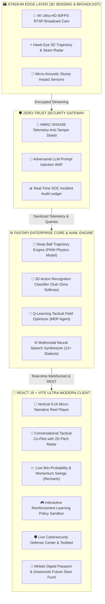
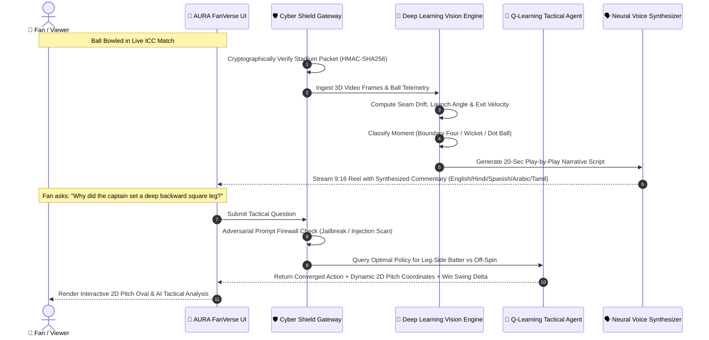
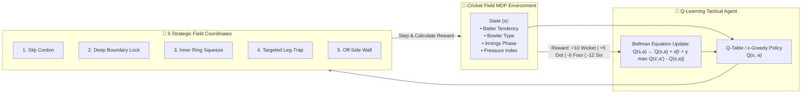

# AURA-FanVerse-AI-Powered-Multimodal-Storytelling-Fan-Co-Creation-

<p align="center">
  
  
  
  
</p>

> **AURA FanVerse** is an enterprise multimodal AI sports storytelling, conversational tactical co-piloting, and direct athlete micro-sponsorship ecosystem built for the **ICC Global Hackathon 2026 (Dubai AI Festival Showcase)**.
> 
> Targeting **Problem Statement 1 (Sport Visibility & Engagement)** and **Problem Statement 2 (Next-Gen Fan Experiences)** with a special mission to elevate **Women in Sport**.

---

## 📐 3D Multi-Layer Architectural & Dataflow Diagrams

### 1. High-Level 3D System Topology



---

### 2. 3D Isometric Multimodal Data Pipeline



---

### 3. Reinforcement Learning Tactical Agent Flow



---

## 🌟 Key Pillars & Features

| Module | Technologies | What It Does |
|---|---|---|
| **📱 Micro-Narratives Hub** | Multimodal AI, React, Web Speech API | Autonomous 9:16 vertical highlights in <45s with real-time HUD telemetry and voice commentary in 5 languages. |
| **🧭 Tactical Co-Pilot** | Vector RAG, Coordinate Geometry, React | Natural-language conversational strategy companion with dynamic 2D field radar and win-probability delta metrics. |
| **📊 Match Analytics Radar** | Recharts, Area/Bar/Radar Visualizers | Dynamic win probability area charts, head-to-head tactical balance radars, and pitch quadrant scoring efficiency. |
| **🤖 RL Tactical Optimizer** | Python, NumPy, Q-Learning, MDP | Autonomous reinforcement learning agent training optimal 11-player field configurations against batter shot distributions. |
| **🛡️ Cybersecurity SOC** | HMAC-SHA256, Regex Firewall, Token Bucket | Anti-tamper telemetry packet signing, adversarial prompt injection shield, and real-time SOC incident ledger. |
| **💖 Athlete Digital Passport** | Canvas Confetti, Gamification | Grassroots micro-sponsorship hub backing women cricketers with 15% dedicated to the ICC Future Stars Fund. |

---

## 📂 Repository Contents

* 📄 **[15-Slide Master Pitch Deck (PPTX)](docs/AURA_FanVerse_Pitch_Deck.pptx):** Professionally styled 16:9 presentation.
* 📑 **[15-Slide Presentation Reference (Markdown)](docs/PITCH_DECK_15_SLIDES.md)**
* 📝 **[2-Page Executive Summary Paper](docs/EXECUTIVE_SUMMARY.md)**
* 🎬 **[3-Minute Demo Video Pitch Script](docs/DEMO_VIDEO_SCRIPT.md)**
* 🏛️ **[Fullstack Technical Architecture Doc](docs/FULLSTACK_ARCHITECTURE.md)**
* ⚡ **`server/`:** FastAPI backend with deep learning trajectory engine, RL agent, and cybersecurity shield.
* 💻 **`prototype/`:** React 19 + TypeScript + Vite frontend with Tailwind CSS and Recharts.

---

## 🚀 Quickstart Guide

### 1. Launch FastAPI Backend
```bash
cd server
python main.py
```
*API runs at `http://127.0.0.1:8000` (Swagger docs at `http://127.0.0.1:8000/docs`).*

### 2. Launch Interactive Frontend
```bash
cd prototype
npm install
npm run dev
```
*Frontend opens at `http://localhost:5173`.*

---

## 👥 Built for ICC Global Hackathon 2026
*Showcase Destination: **Dubai AI Festival (October 2026)** at the Ignyte Innovation Hub.*
