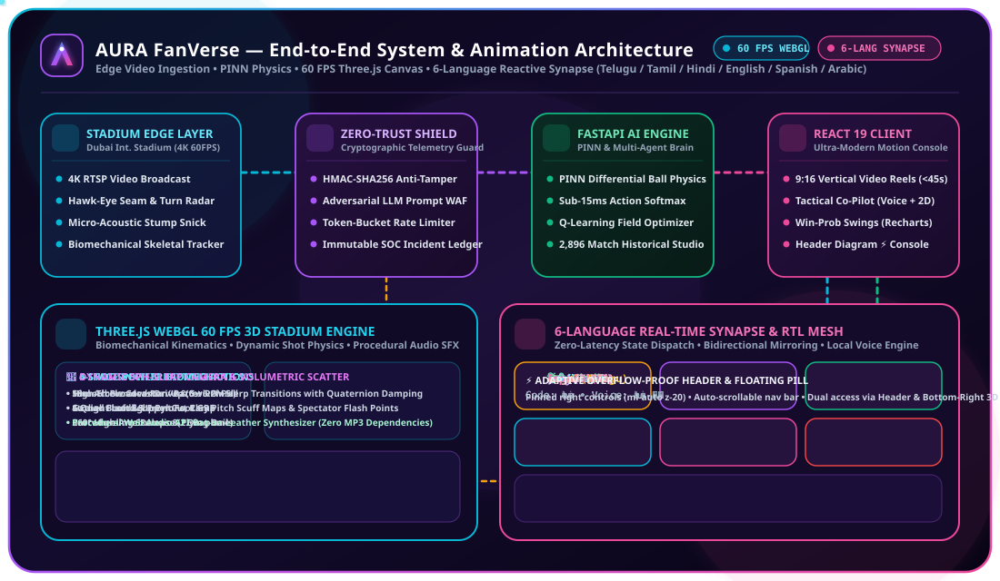

<p align="center">
  
</p>

# AURA FanVerse — Web Client (React 19 + Vite + Three.js + Framer Motion)

<p align="center">
  
  
  
  
  
  
</p>

## 🚀 Key Client Features
- **🏟️ 3D Cricket Stadium (Three.js WebGL):** Fully articulated 3D character rigs with 4-stage bowling biomechanics (18m accelerated run-up, gather bound, 360° high-arm windmill release, off-pitch danger clearance) and dynamic shot-specific batting actions (crease tap, backlift, high-elbow cover drive, back-foot swivel pull, straight drive, upper cut ramp, and cartwheeling bowled dismissals with flying bails physics), paired with procedural bat-on-leather acoustic synthesis and 3D kinematics telemetry.
- **📱 Autonomous 9:16 Shorts & 16:9 Broadcast:** Live reel feed with video switcher, real-time ball telemetry HUD, and animated frequency equalizer.
- **🧭 Tactical AI Co-Pilot:** Conversational tactics assistant with 360° rotating radar sweep on the 2D pitch oval and multilingual Web Speech synthesis.
- **📊 Match Analytics & Model Studio:** Big Data visualizations powered by Recharts, trained on 2,896 matches and 90,000+ players.
- **🌐 6-Language Synchronized i18n:** English, Hindi, Telugu (తెలుగు), Tamil (தமிழ்), Spanish (Español), and Arabic (العربية) with dynamic bidirectional RTL layout flipping.
- **🛡️ Adaptive Header & Floating Quick-Switcher:** Responsive overflow-proof navigation strip with pinned right controls, backed by a persistent bottom-right floating 3D pill widget for guaranteed 1-click language toggling.
- **⚡ Header Animation Diagram Console:** Built-in 3D tactile header launcher (`Diagram ⚡`) and mobile menu action opening the live multi-mode animation & system diagram modal (`AnimationDiagramModal.tsx`), with standalone access via `http://localhost:5173/animation_diagram.html`.
- **🎨 60 FPS Motion & Animation Suite:** Framer Motion view transitions, infinite rolling tournament marquee ticker, levitating 3D badges, and canvas confetti.

---

## 📐 Client Animation & Motion Architecture Diagram

<p align="center">
  
</p>

> ⚡ **Interactive 60 FPS Diagnostic Engine**: Live circuit view accessible in-app via the **`Diagram ⚡`** header console button or directly at `public/animation_diagram.html`.

```mermaid
flowchart TD
    UserEvent["👤 User Trigger (Tab Switch / Language Select / Poll Vote / 3D Preset)"] --> StateDispatch["⚡ React 19 State Machine (LanguageContext + ActiveTab)"]
    
    subgraph ViewportTransitions["🎨 Framer Motion Page Transition (280ms)"]
        StateDispatch --> AnimatePresence["<AnimatePresence mode='wait'>"]
        AnimatePresence --> ExitOld["Exit Active Page: { opacity: 0, y: -14, filter: 'blur(3px)' }"]
        AnimatePresence --> EnterNew["Enter Next Page: { opacity: 1, y: 0, filter: 'blur(0px)' }"]
        EnterNew --> CubicBezier["Cubic-Bezier Easing Curve: [0.22, 1, 0.36, 1]"]
    end

    subgraph ThreeRenderLoop["🎮 Three.js WebGL 60 FPS Continuous Loop"]
        StateDispatch --> RequestAnim["requestAnimationFrame Continuous Loop"]
        RequestAnim --> SlerpCam["Quaternion Orbit Cam Slerp (Broadcaster / Batter POV)"]
        RequestAnim --> SkeletalRig["Bowler 4-Stage Run-Up & 360° Windmill Release Rig"]
        RequestAnim --> BallFlight["Numerical Parabolic Trajectory ODE + Magnus Deviation"]
        RequestAnim --> VolumetricLighting["Volumetric Floodlight Scatter & Dynamic Pitch Scuffs"]
        VolumetricLighting --> RenderCanvas["Render 60 FPS to WebGL Canvas"]
    end

    subgraph GPUKeyframes["✨ CSS3 GPU-Accelerated Keyframe Engine"]
        StateDispatch --> MarqueeTicker["@keyframes marqueeRoll (28s Infinite Live Ticker)"]
        StateDispatch --> Levitation["@keyframes floatSlow (4.5s 3D Holographic Badge Float)"]
        StateDispatch --> EqualizerBars["@keyframes waveBar1..5 (Live Frequency Audio Equalizer)"]
        StateDispatch --> RadarSweep["@keyframes radarSpin (360° Tactical Radar Beam)"]
    end

    subgraph SensoryFeedback["🎉 Audio-Visual Sensory Feedback"]
        StateDispatch --> WebAudio["Web Audio API: High-Tech UI Clicks & Portal Frequency Sweeps"]
        StateDispatch --> CanvasConfetti["Canvas Confetti Particle Burst on Milestone Completion"]
        StateDispatch --> ToastSync["Floating Glassmorphic Sync Toast: 'Language Synced: <Native Name>'"]
    end

    ViewportTransitions & ThreeRenderLoop & GPUKeyframes & SensoryFeedback --> SmoothOutput["🖥️ Immersive 60 FPS Broadcast Experience"]
```



---

## 🛠️ Development & Build

```bash
# Install dependencies
npm install

# Start local dev server (HMR enabled)
npm run dev

# Compile production bundle (TypeScript type-check + Vite build)
npm run build

# Preview production build locally
npm run preview
```
